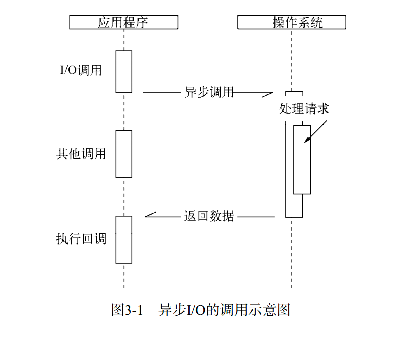
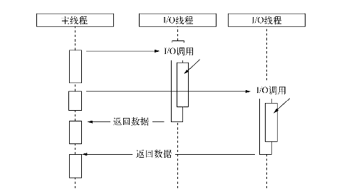
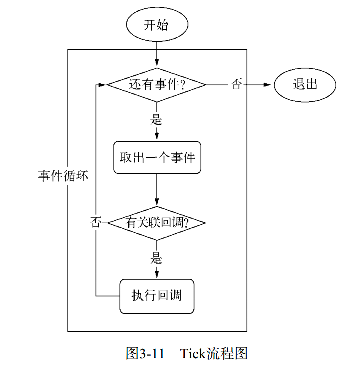
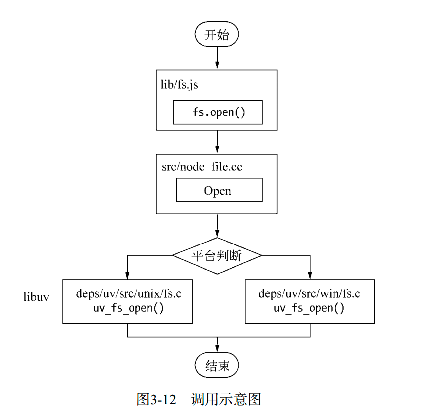

说起异步，做为前端最先想到的是Ajax。简单的代码如下。

```
$.ajax()
    .done()
    .always()
```

## 这里要就要引入一个问题，为什么要引入异步Ajax ##

从用户体验来看，浏览器中的js在单线程中执行，而且与UI渲染共用一个线程。也就是说，js执行时候，ui渲染和相应是处于停滞的。所以，我们常说，把js脚本在html的底部引入就是因为这个原因。如果我们请求一个短信，需要一个接口请求验证码，如果是同步的话，我们需要等待服务端返回指定的信息，如果这个请求的时间稍长，页面在这段时间内是锁死的。对用户来说，这是个很差的体验。前端通过异步的操作，我们等待接口返回是个异步操作，等待时间中，我可以去进行其它交互行为，不会影响用户去做其它的操作。

如果进行两个请求操作的话。二者需要消耗的时间分别为A ms and B ms

如果是同步，总共耗时 A+B
如果是异步，总共耗时 Max(A,B)

显然异步时间开销更小。

排除用户体验方面的干扰我们从资源分配的角度来思考这个问题。
现在主流的方法有两种
- 单线程串行依次执行

    单线程串行虽然易于理解表达。但是资源会因为阻塞会不能够很好的利用。

- 多线程并行完成

    多线程的问题在于创建线程和执行县城上下文切换的开销较大。复杂业务，多线程编程经常面临锁，状态同步等问题。但多线程在多核cpu中能够有效提升cpu利用率。这是一个很大的优势。

Node的方案是利用单线程，远离多线程死锁、状态同步等问题；利用一步I/O，让单线程远离阻塞，以更好的利用CPU。

它期望I/O的调用不再阻塞后续运算，将原有等待I/O完成的这段时间分配给其余需要的业务去执行。

 

 
 ### 现实的异步I/O ###

 在场景是单线程的状况下。通过让部分线程进行阻塞I/O或者非阻塞I/O加轮询技术来完成数据获取，让一个线程进行计算处理。通过线程间的通信将I/O得到的数据进行传递，便实现了一个异步I/O

 


 由于windows平台和linux的天生差异。Node提供了libuv作为抽象封装层，使平台兼容性的判断都由这一层来完成。

 * 我们强调的单线程仅仅只是js执行在单线程中。在node中，无论在哪个平台，内部完成I/O任务的另有线程池 *


 ## Node异步I/O ##

 ### 事件循环 ###
 
 先说一下Node自身的执行模型，事件循环。跟js的事件循环基本相同。在启动时，Node会创建一个循环.这个循环体执行一次的过程被称为Tick。每个Tick的过程如下。
 ```
 var eventLoop = []
while(true){

}
 ```
 

 ### 观察者 ###

每个Tick的过程，如果判断是否有事件需要处理？这里引入观察者的概念。

 ### 请求对象 ###

 对于一般的毁掉函数，函数是我们自行调用。
 ```
 var forEach = function(list,cb){
     for(var i=0;i<list.length;i++){
         callback(list[i],i,list)
     }
 }
 ```
对于Node 的异步I/O调用而言，回调函数不应由开发者调用。事实上，从js发起调用到内核执行完IO操作的过程中，存在着中间产物，叫做请求对象。

以`fs.open`作为例子，来一探究竟是如何进行底层调用的。
```
fs.open = function(path,flags,mode,callback){
    binding.open(pathModule._makeLong(path),
        stringToFlags(flags),
        mode,
        callback);
    )
}
```
js层面的代码通过调用c++核心模块进行下层操作，具体过程如下



从JavaScript调用Node的核心模块，核心模块调用C++内建模块，内建模块通过libuv进行系统调用，这是Node里经典的调用方式。。`libuv`作为封装层，有两个平台的实现，实质上是调用了`uv_fs_open`方法。

`uv_fs_open`的调用过程中，我们创建了一个 `FSReqWrap`请求对象。从JavaScript层传入的参数和当前方法都被封装在这个请求对象中.我们最为关注的回调函数则被设置在这个对象的`oncomplete_sym`属性上:
 ```
    req_wrap->object_>Set(oncomplete_sym,callback)
 ```
 对象包装完毕后，在windows下，则调用`QueueUserWorkItem()`方法将这个 `FSReqWrap`对象推入线程池中等待执行，代码如下
 ```
    QueueUserWorkItem(&uv_fs_thread_proc),
                        req,
                        WT_EXECUTEDEFAULT)
 ```
`QueueUserWorkItem`方法接受3个参数，第一个是将要执行的方法的引用，这里引用的是`uv_fs_thread_proc`，第二个参数是`v_fs_thread_proc`方法运行时所需要的参数;第三个参数是执行的标志。当线程池中有可用线程时，我们会调用`uv_fs_thread_proc`方法。`uv_fs_thread_proc`方法会根据传入的参数的类型调用相应的底层函数。`uv_fs_open`实际上调用的是`fs_open`方法


 ### 执行回调 ###