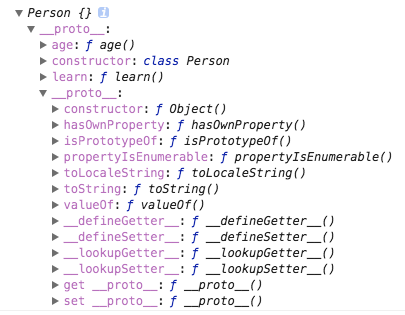

# 观察__proto__ #

```js
class Person{
    constructor(){

    }
    age(){
        return 26 
    }
    learn(){

    }
}

```

 

 我特地展开`__proto__`对象并截图，

 Person的实例，通过一个__proto__指向一个对象，这个对象有constructor属性，该属性为`class Person`

 我先试着猜想，这个`__proto__`指向Person

 可是
 ```
 p.__proto__ == Person //false
 ```

```
 p.__proto__ == Person.prototype // true
```

so

p.__proto__ 指向的是Person类的prototype

```
p.__proto__.__proto__ == Object.prototype // true
```

不难得出，__proto__总是指向它父类的原型链。

可以使用__proto__来修改原型链的指向。但是因为它有性能问题。


## class ##

es6中添加了该关键字，它的作用是创建一个基于原型继承的类。

class是语法糖，它的本质还是函数。

还记得我们如何创建一个基于原型的类么

```
function Person(){

}
Person.prototype = {
    //add some method
}
```

## 类表达式 ##

没多么复杂，只是另一种写法。

```
var Foo = class {
  constructor() {}
  bar() {
    return "Hello World!";
  }
};

```
等同于

```
class Foo{
  constructor() {}
  bar() {
    return "Hello World!";
  }
};
```


## constructor ## 

构造函数方法是一种特殊的方法，用于创建和初始化一个类中创建的对象。

- 何时调用?

    每个class都会默认一个constructor。通过new 命令生成实例时，自动调用该方法。如果没有显示定义，会默认添加一个constructor方法。

- constructor会默认返回一个实例对象。`(this)`

- class类必须用new调用。直接当做一个函数运行的话，会报错。这与es5里`function Person(){}`的方式有些区别。

## 实现一个new怎么样? ##

step 1.实现目标
    实现一个New方法，当我调用class.New(args)，返回一个对象

    有了如下的实现
```
Function.prototype.NEW = function(args){
   
   return obj
}
```
step 2.class的实例都有个特点，就是它可以使用原型链上的方法，在浏览器里的log里，我们打印一个实例对象，它通过一个`__proto__`方法指向它的类。并且它的this总是指向实例对象。继续完善这个方法。

```
Function.prototype.NEW = function(){
   //this为调用者class
   var o = Object.create(this.prototype)
 
    //修正this.将this指向新的o

   this.apply(o,arguments);

   return o
}
```
success.

## 实例对象 ##

class中的属性除非定义在`对象上`，否则都是定义在原型上。

```
class Person{
    constructor(){
        this.age = 0;
        this.sex = 'male';
    }
    walk(){
        log('person,talk')
    }
    talk(){
        log('talk')
    }
}

var p = new Person()


```

甚至可以粗暴的理解为，设置在Person这个{}下的方法都是直接在原型的Prototype上。

walk,talk都定义在Person.prototype上了。

所以

```
p.hasOwnProperty('talk') // false
```

强势插入`__proto__`

`__proto__` 对实例对象来说，它指向类的prototype

```
p.__proto__ == Person.prototype // true
```
so

```
p.__proto__.hasOwnProperty('talk') // true
```

## extends 继承 ##

extends关键词用来创建一个普通类或者内建对象的子类。

日常使用，都是extends 一个class

有没有想过，我想extends 一个对象呢

别傻了，当然不可以，传入一个对象，会报错。错误信息，自己试一下就知道了。

言归正传，js 是单一原型链的继承模型，简单点，就是通过唯一的prototype来向上查找，获取prototype上的方法，属性，来作为自身的方法属性来使用。

而在实际开发中，我们不可能只需要继承一个类来进行开发。

比如这样 base  -> util -> basePc/baseApp -> entrancePage

此时，我们希望我们的entrancePage 继承上边的多重方法，而我绝对不会去 一个个extends
## super ##

super 关键字用于调用一个对象的父对象上的函数。

- super单独出现时，super关键字必须在this关键字之前使用
- 不注意的是，super可以直接调用父对象上的函数
- copy的mdn上的demo.super可以调用父类的静态方法。此时，可以理解super为对象，可以通过super.prop这种方式调用父类上的函数。
```
class Human {
  constructor() {}
  static ping() {
    return 'ping';
  }
}

class Computer extends Human {
  constructor() {}
  static pingpong() {
    return super.ping() + ' pong';
  }
}
Computer.pingpong(); // 'ping pong'
```

- 接上，要注意，super 其实指向的是father.prototype，所以如果父类实例上的属性，是无法通过super.prop取到的。

- 阮老师的书里有个demo也挺好，虽然B的super.print()调用的是

A.prototype.print()，但是绑定的this确是B的this.super.print()执行的时候其实是super.print.call(this)

```script
class A {
  constructor() {
    this.x = 1;
  }
  print() {
    console.log(this.x);
  }
}

class B extends A {
  constructor() {
    super();
    this.x = 2;
  }
  m() {
    super.print();
  }
}
```

- Super.prop 不能覆写不可写属性

- super作为对象，在静态方法中，super指向父类，而不是父类的原型对象。

## __proto__ ##

prototype属性和__proto__属性，因此同时存在两条继承链。

每一个对象都有__proto__属性，指向对应的构造函数的prototype属性

- 子类的__proto__属性，`表示构造函数的继承`，总是指向父类。

- 子类prototype属性的__proto__属性，`表示方法的继承`，总是指向父类的prototype属性。

```script
class Person{
    constructor(){

    }
    talk(){

    }
    walk(){

    }
}

class Man extends Person{
    constructor(){
        super()
    }
}
Man.__proto__ == Person;
Man.prototype.__proto__ = Person.prototype // true
```

## Object.setPrototypeOf ##

Object.setPrototypeOf() 方法设置一个指定的对象的原型 ( 即, 内部[[Prototype]]属性）到另一个对象或  null。

```js
Object.setPrototypeOf(obj, prototype)
//obj要设置其原型的对象。
//prototype 该对象的新原型
// I write a easy demo
var Person = class {
   walk(){
	 console.log('talk')
	}
}
var Man = class {
	talk(){
		return 1
	}
}
var  p = new Person();
p.walk() // talk
Object.setPrototypeOf(p,Man.prototype)
p.talk() //1
p.walk() // TypeError: p.walk is not a function
```

## set get操作 ##

在class内通过`set`,`get`关键字，对某个属性设置存取函数。

demo

```js
var demo = class {
    set prop(value){

    }
    get prop(){

    }
}

```

## mixin模式的继承 ##

实际开发中，我们很可能让一个类，继承多个类来更好的实现业务.而mixin作的就是把多个类混入一个类。从而，我们只需要继承这一个类就可以了。还是copy阮老师的方法。

```js
function mix(...mixins) {
  class Mix {}

  for (let mixin of mixins) {
    copyProperties(Mix, mixin);
    copyProperties(Mix.prototype, mixin.prototype);
  }

  return Mix;
}

function copyProperties(target, source) {
  for (let key of Reflect.ownKeys(source)) {
    if ( key !== "constructor"
      && key !== "prototype"
      && key !== "name"
    ) {
      let desc = Object.getOwnPropertyDescriptor(source, key);
      Object.defineProperty(target, key, desc);
    }
  }
}
```

稍微解释下copyProperties这个方法，对传入的source类，先通过Reflect.ownKeys(source))来获取source上的所有key的name，也就是属性或者方法名，如果传入的是Array.prototye，这些key就是挂在prototype上的方法，比如slice，pop，join，shift，unshift，再通过Object.getOwnPropertyDescriptor(source, key)获取描述符，并通过Object。defineProperty来设置到target对象上。


## 原型模式的优点 ##

可以让所有的实例对象，共享原项链上的方法。但是这里也有个问题，那就是我两个实例A,B都继承了Person，如果我有一个需求想要修改A的原型链上的某个属性attr为数字，我直接修改Person原型虽然是可以达到的，但是此时B实例上的属性也会被修改。

原型模式通过一个prototye属性，这个prototype其实就是一个指针，指向一个对象，你当前的对象通过这个指针的指向，可以借用指向的对象上的方法属性和方法。对于有类似功能对象，我们就不必在重新定义类似的相同的方法，或者属性。

## 补充 ##

- class类不存在变量提升，必须保证子类在父类后边，new操作在类后边